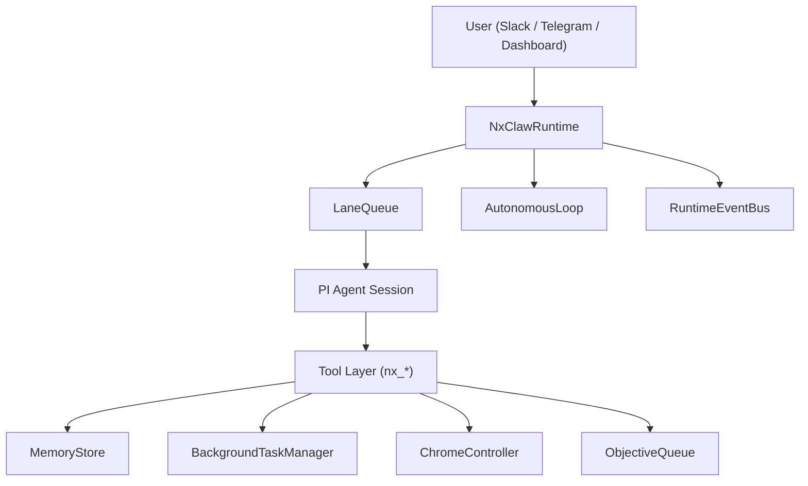

# nxclaw
OpenClaw에서 영감을 받은, JS 기반 자율형 에이전트 런타임입니다.
`nxclaw`의 목표는 단순 챗봇이 아니라, 장기 실행 가능한 실행 시스템입니다.

핵심 철학:
- 지속성: 한 번의 대화가 아니라, 장기 목표를 이어서 수행
- 기억력: 단기/중기/장기 기억을 파일 기반으로 안정적으로 유지
- 실행력: 터미널, 브라우저, 백그라운드 태스크를 실제로 제어
- 관측성: 지금 무엇을 하는지 상태/이벤트로 추적 가능

## 서비스 소개

`nxclaw`는 다음 문제를 해결하기 위해 설계되었습니다.

- 긴 업무를 맡기면 중간에 멈추거나 맥락을 잃는 문제
- 재시작 후 상태가 사라져 연속성이 깨지는 문제
- 브라우저/OS 레벨 작업을 안정적으로 자동화하기 어려운 문제
- 메모리가 쌓이기만 하고 검색 품질이 떨어지는 문제

`nxclaw`는 OpenClaw의 코어 아이디어를 JS 런타임으로 재구성하여,
운영 가능한 자율형 에이전트 플랫폼으로 발전시키는 것을 목표로 합니다.

## 핵심 기능 요약

- JS 기반 PI 코어 런타임
- 인증 제공자 3개 지원
- `google-gemini-cli`
- `openai-codex`
- `anthropic`
- 채널 지원
- Slack
- Telegram
- Web Dashboard
- 도구 실행
- Terminal 실행/큐/스케줄/중지/로그
- Chrome 자동화(Playwright + CDP)
- 메모리 시스템
- `MEMORY.md` 장기기억
- `memory/YYYY-MM-DD.md` 일일기록
- `memory/sessions/*.md` 세션기억
- `SOUL.md` + 소울 저널
- BM25 + 벡터 하이브리드 검색
- Skills 설치/활성/비활성/제거

## 아키텍처 개요



구성 요소 설명:

- `NxClawRuntime`
- 입력을 받아 세션별 실행을 조율하는 중심 런타임
- `LaneQueue`
- lane 단위 직렬화 + lane 간 병렬화
- 동일 세션 충돌 방지, 다른 세션 동시 실행 보장
- `AutonomousLoop`
- 주기적으로 목표를 평가하고 자동 실행
- 실패 누적 시 자동 비활성화(회로 차단)
- `BackgroundTaskManager`
- OS 명령 실행, 재시도, 타임아웃, 스케줄 관리
- `ChromeController`
- `launch` 모드와 `cdp` attach 모드 지원
- CDP 실패 시 launch 자동 failover 지원
- `MemoryStore`
- 파일 기반 기억 저장소 + 하이브리드 검색 + 컴팩션
- `RuntimeEventBus`
- 최근 이벤트 버퍼 + 파일 플러시로 관측성 제공

## 런타임 핵심 개념

### Autonomous Loop란?

자동 주기로 에이전트가 스스로 일을 가져와 실행하는 루프입니다.

- 동작 조건
- `enabled=true`
- 런타임이 바쁘지 않음
- 큐 압력/태스크 압력 임계치 이내
- 연속 실패 임계치 미만
- 보호 장치
- `skipWhenQueueAbove`
- `maxConsecutiveFailures`
- 실패 누적 시 자동 disable

구현 파일:
- `/nxclaw/src/runtime/autonomous-loop.js`

### Active Run이란?

현재 실행 중인 단위 작업 추적 정보입니다.

- `runId`, `lane`, `source`, `startedAt`, `textPreview`
- 대시보드에서 현재 무슨 일을 하는지 실시간 파악 가능

구현 파일:
- `/nxclaw/src/runtime/nxclaw-runtime.js`

### LaneQueue란?

세션별 충돌을 막는 핵심 실행 큐입니다.

- 같은 lane: 직렬 처리
- 다른 lane: 병렬 처리
- 총 depth 상한으로 폭주 방지

구현 파일:
- `/nxclaw/src/runtime/lane-queue.js`

## 메모리 시스템 상세

## 핵심 원칙

파일이 진실의 원천(Source of Truth)입니다.
모델 기억은 디스크에 저장된 내용을 기준으로 재구성됩니다.

### 기억 계층

| 계층 | 역할 | 저장 위치 |
|---|---|---|
| 단기(대화 원본) | 최근 대화 원본 | `~/.nxclaw/memory/raw.jsonl` |
| 중기(일일/세션) | 오늘/세션 단위 맥락 | `~/.nxclaw/workspace/memory/YYYY-MM-DD.md`, `~/.nxclaw/workspace/memory/sessions/*.md` |
| 장기(승격 기억) | 중요한 사실/결정 | `~/.nxclaw/workspace/MEMORY.md`, `~/.nxclaw/memory/compact.jsonl` |
| 정체성 | 성향/원칙/태도 | `~/.nxclaw/workspace/SOUL.md`, `~/.nxclaw/workspace/memory/soul-journal/*.md` |

### 검색 방식

- BM25 키워드 검색
- 벡터 유사도 검색
- source type 가중치
- session strict 모드 지원

벡터 동작:
- OpenAI 키가 있으면 OpenAI 임베딩
- Gemini 키가 있으면 Gemini 임베딩
- 키가 없거나 실패 시 local 임베딩 fallback

### 컴팩션

- raw가 임계치 이상이면 자동 컴팩션
- 중요한 이벤트를 먼저 flush
- 요약 결과를 long-term과 compact markdown에 기록

구현 파일:
- `/nxclaw/src/memory/memory-store.js`

### 최근 안정성 보강

- `session_strict` 검색에서 타 세션 누수 차단
- 관련도 0 항목이 source boost만으로 검색되는 노이즈 제거

구현 위치:
- `/nxclaw/src/memory/memory-store.js`

## 파일 시스템 구조와 의미

## 1) 런타임 홈 디렉토리 `~/.nxclaw`

```text
~/.nxclaw
├── agent/
│   ├── auth.json
│   └── models.json
├── chrome/
│   └── shots/
├── docs/
│   ├── RUNBOOK.md
│   └── START_HERE.md
├── logs/
├── memory/
│   ├── raw.jsonl
│   └── compact.jsonl
├── skills/
├── state/
│   ├── dashboard.json
│   ├── objectives.json
│   ├── tasks.json
│   ├── events.jsonl
│   ├── memory-index.json
│   ├── embedding-cache.json
│   └── lane-sessions/
├── workspace/
│   ├── AGENTS.md
│   ├── BOOTSTRAP.md
│   ├── HEARTBEAT.md
│   ├── IDENTITY.md
│   ├── MEMORY.md
│   ├── SOUL.md
│   ├── TOOLS.md
│   ├── USER.md
│   └── memory/
│       ├── YYYY-MM-DD.md
│       ├── sessions/
│       ├── soul-journal/
│       └── compact-md/
└── config.json
```

## 2) 루트 MD(워크스페이스 MD) 의미

- `IDENTITY.md`
- 에이전트 정체성 정의
- `TOOLS.md`
- 어떤 툴을 어떤 원칙으로 쓰는지 정의
- `USER.md`
- 사용자 선호/운영 규칙
- `AGENTS.md`
- 다중 에이전트/역할 설정
- `BOOTSTRAP.md`
- 시작 시 로딩 순서/초기 규칙
- `HEARTBEAT.md`
- 주기 점검 항목
- `MEMORY.md`
- 장기 기억 본문
- `SOUL.md`
- 성향/태도/원칙

## 3) 기억이 실제로 남는 흐름

1. 대화/결과가 raw+daily+session에 저장
2. 인덱스가 동기화되어 검색 가능 상태가 됨
3. 중요 정보는 long-term으로 승격
4. 오래된 raw는 compaction으로 요약/정리
5. 재시작 후에도 파일 기반으로 복원

## Chrome 자동화와 확장 프로그램

`nxclaw`는 두 가지 모드를 지원합니다.

- `launch`
- nxclaw가 별도 Chrome 프로세스를 실행
- `cdp`
- 사용자의 기존 Chrome에 attach

중요:
- 확장 프로그램이 없어도 CDP attach는 동작합니다.
- `nxclaw-helper` 확장은 편의 기능입니다.
- CDP 실패 시 launch failover 가능

관련 설정:

```bash
export NXCLAW_CHROME_MODE="cdp"
export NXCLAW_CHROME_CDP_URL="http://127.0.0.1:9222"
export NXCLAW_CHROME_CDP_FALLBACK_TO_LAUNCH="true"
export NXCLAW_CHROME_PATH="/Applications/Google Chrome.app/Contents/MacOS/Google Chrome"
```

확장 경로:
- `/nxclaw/extensions/nxclaw-helper`

## OpenClaw 대비 nxclaw의 현재 강점

주의: 아래는 "현재 코드베이스 기준" 비교입니다.

- JS 중심 단일 런타임으로 운영 단순화
- CDP attach + launch failover로 브라우저 탄력성 강화
- session strict 메모리 격리 강화
- 대시보드/이벤트 기반 관측성 단순화
- skills 설치/활성/제거 워크플로우 내장

## 앞으로 개선할 항목

- LLM 비용 하드가드
- 시간/일 단위 호출량 상한 + 자동 pause
- 메모리 스토리지 선택지
- SQLite(WAL) 백엔드 옵션 추가
- 분산 실행
- 다중 워커/원격 노드 실행 모델
- 장애 복구
- 프로세스 감시 강화, 자동 재시작 정책 고도화
- 운영 리포트
- 일/주 단위 자동 진단 및 이상 탐지 리포트

## 설치와 시작

사전 요구사항:
- Node.js 22+

### 0) 초보자용 터미널 온보딩 위자드 (권장)

처음 사용자라면 아래 2줄만 실행하면 됩니다.

```bash
cd /nxclaw
npm install && npm run onboard
```

`npm run onboard`에서 바로 설정할 수 있는 항목:
- 기본 LLM provider 선택 (`google-gemini-cli` / `openai-codex` / `anthropic`)
- 채널 선택 (`web`, `telegram`, `slack`)
- 대시보드 host/port
- autonomous on/off + interval + goal
- 텔레그램 토큰
- 슬랙 토큰/시크릿/허용 채널

온보딩 결과:
- 런타임 설정 저장: `~/.nxclaw/config.json`
- 워크스페이스 코어 MD 자동 생성: `~/.nxclaw/workspace/*.md`
- 현재 프로젝트 루트 `.env`에 `nxclaw onboarding` 블록 자동 생성/갱신
  - 파일 위치: `/nxclaw/.env`
  - 블록 경계: `# >>> nxclaw onboarding >>>` / `# <<< nxclaw onboarding <<<`

1. 설치

```bash
cd /nxclaw
npm install
npm run onboard
```

2. 인증 설정 (택1 이상)

```bash
npm run auth -- --provider openai-codex
# 또는
npm run auth -- --provider google-gemini-cli
# 또는
npm run auth -- --provider anthropic
```

3. 인증 상태 확인

```bash
npm run auth -- --status
```

4. 실행

```bash
npm run start
```

5. 대시보드

```text
http://127.0.0.1:3020
```

6. 상태 확인

```bash
npm run status
```

## 운영 권장 설정

- 초기 안정화 구간(1~2주)
- 자동루프를 보수적으로 운용
- 큐/동시성/재시도 수치를 낮게 시작
- 안정화 후
- objective 중심 자동화 확대
- 메모리 컴팩션 주기 점검
- 주기 점검
- `npm run status`
- `/api/memory/stats`, `/api/state` 확인
- events 로그 확인

## 자주 쓰는 명령

```bash
npm run onboard
npm run auth -- --status
npm run start
npm run status
npm run objective -- add "prepare weekly release report" --priority 2
npm run objective -- list
npm run objective -- update <id> --status completed --notes "done"
npm run skills -- catalog
npm run skills -- list
npm run skills -- install --source skills:vercel-labs/agent-skills --skills web-design-guidelines
npm run skills -- enable <skill-id>
npm run skills -- disable <skill-id>
npm run skills -- remove <skill-id>
```

## GitHub 업로드 전 보안 체크

- 로컬 시크릿 파일 제거
- `/nxclaw/.env`가 없어야 함
- 런타임 산출물 제거
- `/nxclaw/memory`
- `/nxclaw/.pi`
- 토큰/키 문자열 재검토
- `NXCLAW_TELEGRAM_BOT_TOKEN`, `OPENAI_API_KEY`, `ANTHROPIC_API_KEY`, `GEMINI_API_KEY`
- 이미 노출된 토큰은 즉시 재발급(rotate)

## 트러블슈팅

### 1) `Authentication required` 응답

원인:
- 인증 정보 없음 또는 모델 공급자 불일치

해결:

```bash
npm run auth -- --provider openai-codex
npm run auth -- --status
```

### 2) Dashboard 외부 바인딩 에러

메시지 예:
- `dashboard bind host ... requires NXCLAW_DASHBOARD_TOKEN`

해결:
- `NXCLAW_DASHBOARD_TOKEN` 설정
- 또는 `NXCLAW_DASHBOARD_HOST=127.0.0.1`

### 3) Chrome 동작 실패

원인:
- `launch`에서 경로 누락
- `cdp`에서 포트 미오픈

해결:

```bash
# launch 모드
export NXCLAW_CHROME_MODE="launch"
export NXCLAW_CHROME_PATH="/Applications/Google Chrome.app/Contents/MacOS/Google Chrome"

# cdp 모드
export NXCLAW_CHROME_MODE="cdp"
export NXCLAW_CHROME_CDP_URL="http://127.0.0.1:9222"
```

### 4) 메모리 검색 품질이 낮음

원인:
- 인덱스 범위 과다, 세션 파일 과다, 노이즈 누적

해결:
- 메모리 sync/compact 수행
- 세션 분리 운용
- 필요 시 `NXCLAW_MEMORY_INDEX_MAX_*` 튜닝

### 5) 장시간 운영 중 큐가 쌓임

원인:
- 동시 실행 한도 대비 작업 유입 과다

해결:
- `maxConcurrentTasks` 상향 또는 작업 유입 조절
- 스케줄 태스크 난립 여부 점검
- failedRecent 증가 시 원인 작업 로그 확인

### 6) 텔레그램에서 읽기만 되고 답장이 없음

원인:
- 런타임 프로세스 미실행
- 토큰 누락/오타
- 동일 봇 다중 polling 충돌(`409 Conflict`)

해결:

```bash
# 1) 기존 중복 프로세스 종료
pkill -f "node src/index.js start --no-slack --no-dashboard" || true

# 2) 토큰 포함해서 단일 인스턴스로 실행
export NXCLAW_TELEGRAM_BOT_TOKEN="YOUR_BOT_TOKEN"
npm run start -- --no-slack --no-dashboard
```

확인:
- 텔레그램 DM에서 `/status` 전송
- 런타임 이벤트 로그 확인: `~/.nxclaw/state/events.jsonl`

## 신뢰성 요약

현재 `nxclaw`는 실사용 가능한 운영 베이스입니다.

- 메모리: 파일 기반 영속 + 하이브리드 검색 + 컴팩션 + 세션 격리
- 에이전트: lane 직렬화, task 재시도/타임아웃, autonomous 보호장치
- 브라우저: CDP attach, 확장 보조, failover

다만 "완전 무결한 장기 무인운영" 수준으로 가려면,
LLM 비용 하드가드와 저장소 내구성(예: SQLite WAL 옵션) 고도화를 권장합니다.
